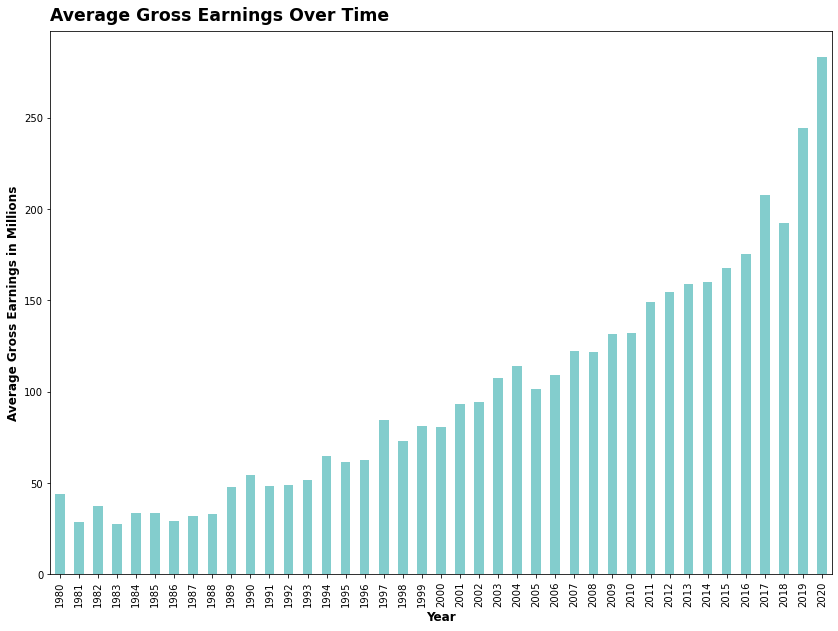
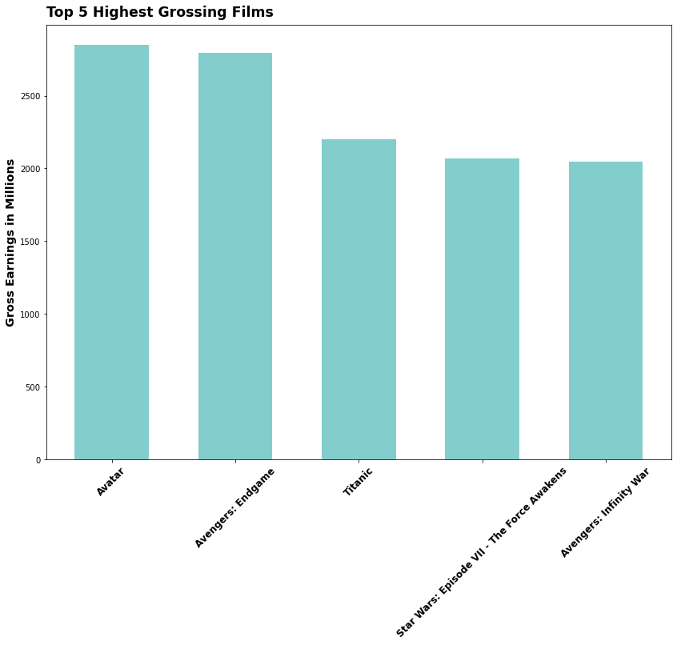
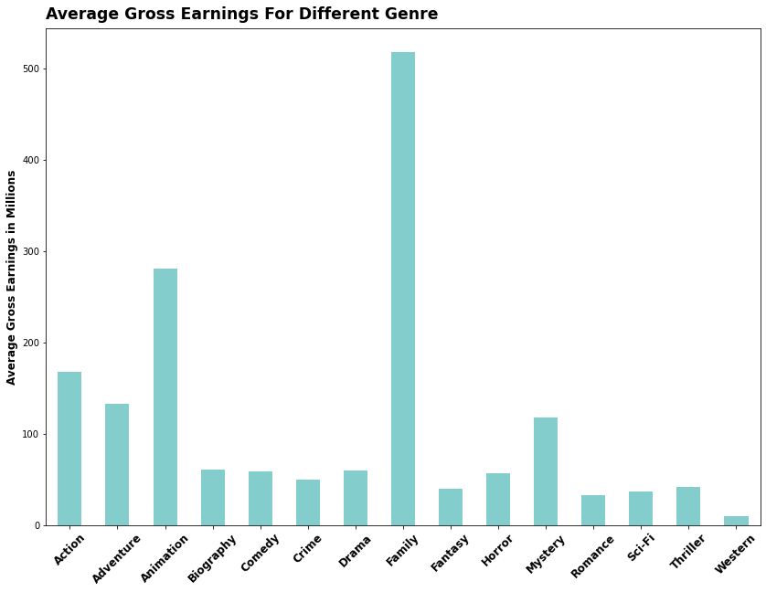
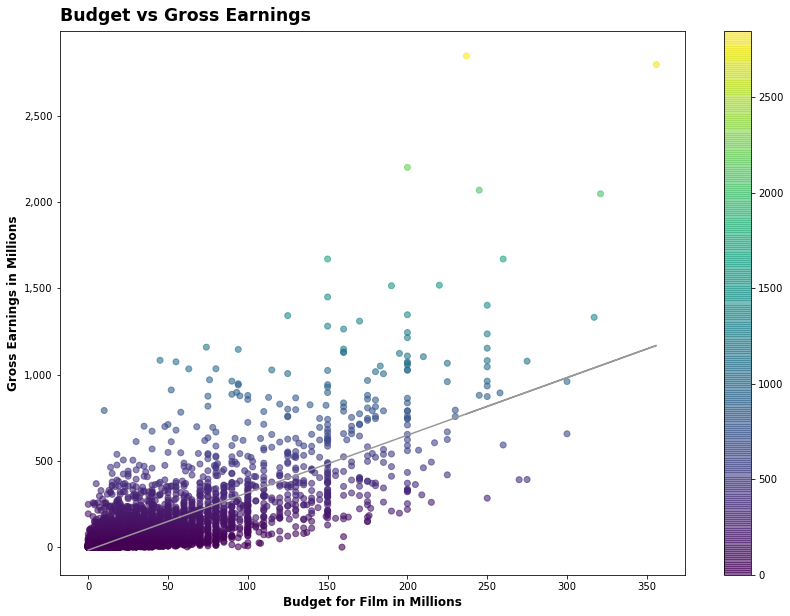
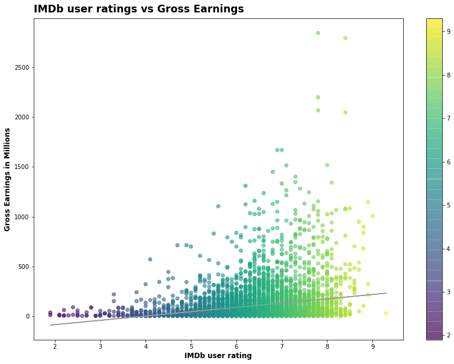
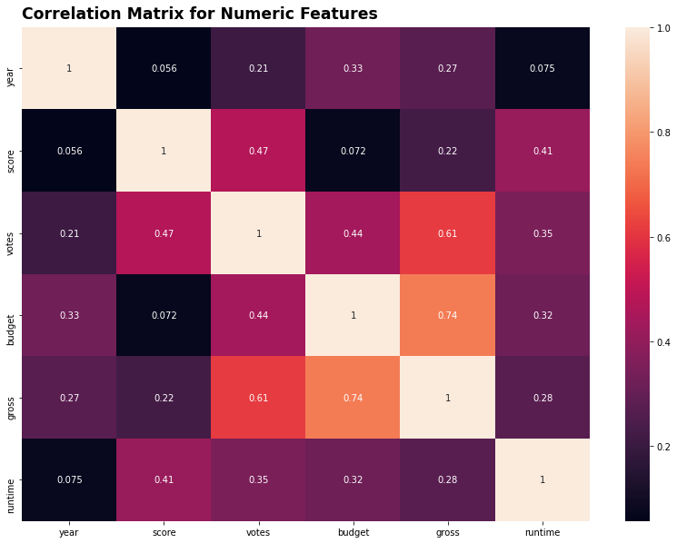
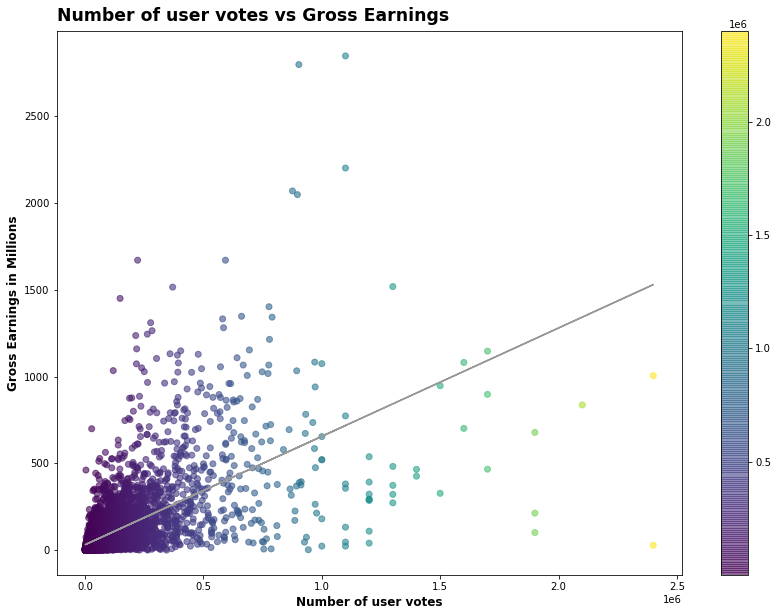
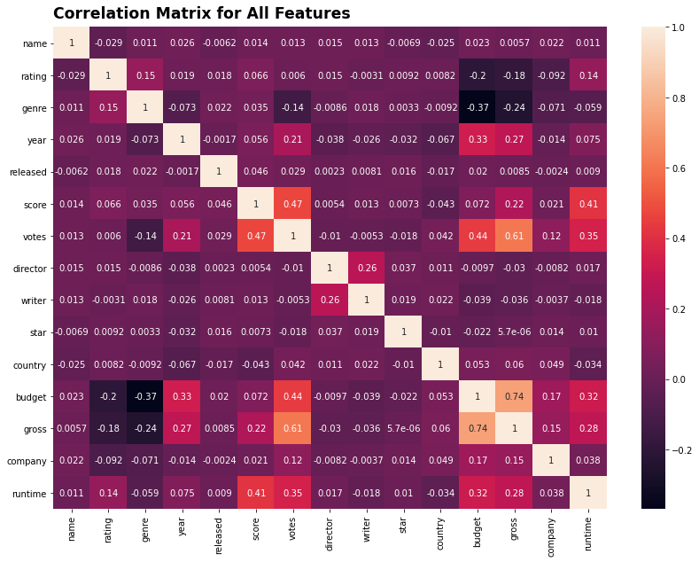

# Is the Movie Industry Dying?

## Introduction
With the rise of Netflix, Disney +, Apple TV and other streaming services growing rapidly with popularity, one must wonder: Is the movie industry is dying? Are streaming services the new king of entertainment? What drives the gross earnings of movie industry?

With this questions in mind, my exploratory data project aims to:

1. Examine how the movie industry been performing in recent years;
2. Visualize the relationship of different variables with movie gross earnings;
3. Explore the variables that have the highest correlation with movie gross earnings

The dataset from this exploratory data analysis was taken from [Kaggle](https://www.kaggle.com/danielgrijalvas/movies). Initial hypothesis for this project are that gross revenue for movies have been declining over the years as adoption of streaming services grows; money spent on making movies `budget`, and IMDb user ratings `score` will have the highest correlation with movie gross earnings.

## Importing libraries and data


```python
# Importing libraries
import pandas as pd
import numpy as np
import seaborn as sns

import matplotlib.pyplot as plt
import matplotlib.mlab as mlab
import matplotlib
import matplotlib.ticker as mticker
plt.style.use('default')
from matplotlib.pyplot import figure

%matplotlib inline
matplotlib.rcParams['figure.figsize'] = (14,10)

pd.options.mode.chained_assignment = None

# Read in data
df = pd.read_csv('movies.csv')
```


```python
# Glimpse at data
df.head()
```


<div>
<style scoped>
    .dataframe tbody tr th:only-of-type {
        vertical-align: middle;
    }

    .dataframe tbody tr th {
        vertical-align: top;
    }

    .dataframe thead th {
        text-align: right;
    }
</style>
<table border="1" class="dataframe">
  <thead>
    <tr style="text-align: right;">
      <th></th>
      <th>name</th>
      <th>rating</th>
      <th>genre</th>
      <th>year</th>
      <th>released</th>
      <th>score</th>
      <th>votes</th>
      <th>director</th>
      <th>writer</th>
      <th>star</th>
      <th>country</th>
      <th>budget</th>
      <th>gross</th>
      <th>company</th>
      <th>runtime</th>
    </tr>
  </thead>
  <tbody>
    <tr>
      <th>0</th>
      <td>The Shining</td>
      <td>R</td>
      <td>Drama</td>
      <td>1980</td>
      <td>June 13, 1980 (United States)</td>
      <td>8.4</td>
      <td>927000.0</td>
      <td>Stanley Kubrick</td>
      <td>Stephen King</td>
      <td>Jack Nicholson</td>
      <td>United Kingdom</td>
      <td>19000000.0</td>
      <td>46998772.0</td>
      <td>Warner Bros.</td>
      <td>146.0</td>
    </tr>
    <tr>
      <th>1</th>
      <td>The Blue Lagoon</td>
      <td>R</td>
      <td>Adventure</td>
      <td>1980</td>
      <td>July 2, 1980 (United States)</td>
      <td>5.8</td>
      <td>65000.0</td>
      <td>Randal Kleiser</td>
      <td>Henry De Vere Stacpoole</td>
      <td>Brooke Shields</td>
      <td>United States</td>
      <td>4500000.0</td>
      <td>58853106.0</td>
      <td>Columbia Pictures</td>
      <td>104.0</td>
    </tr>
    <tr>
      <th>2</th>
      <td>Star Wars: Episode V - The Empire Strikes Back</td>
      <td>PG</td>
      <td>Action</td>
      <td>1980</td>
      <td>June 20, 1980 (United States)</td>
      <td>8.7</td>
      <td>1200000.0</td>
      <td>Irvin Kershner</td>
      <td>Leigh Brackett</td>
      <td>Mark Hamill</td>
      <td>United States</td>
      <td>18000000.0</td>
      <td>538375067.0</td>
      <td>Lucasfilm</td>
      <td>124.0</td>
    </tr>
    <tr>
      <th>3</th>
      <td>Airplane!</td>
      <td>PG</td>
      <td>Comedy</td>
      <td>1980</td>
      <td>July 2, 1980 (United States)</td>
      <td>7.7</td>
      <td>221000.0</td>
      <td>Jim Abrahams</td>
      <td>Jim Abrahams</td>
      <td>Robert Hays</td>
      <td>United States</td>
      <td>3500000.0</td>
      <td>83453539.0</td>
      <td>Paramount Pictures</td>
      <td>88.0</td>
    </tr>
    <tr>
      <th>4</th>
      <td>Caddyshack</td>
      <td>R</td>
      <td>Comedy</td>
      <td>1980</td>
      <td>July 25, 1980 (United States)</td>
      <td>7.3</td>
      <td>108000.0</td>
      <td>Harold Ramis</td>
      <td>Brian Doyle-Murray</td>
      <td>Chevy Chase</td>
      <td>United States</td>
      <td>6000000.0</td>
      <td>39846344.0</td>
      <td>Orion Pictures</td>
      <td>98.0</td>
    </tr>
  </tbody>
</table>
</div>


## Data Cleaning


```python
# Checking for missing data
for col in df.columns:
    pct_missing = np.mean(df[col].isnull())
    print('{} - {}%'.format(col, pct_missing))
```

    name - 0.0%
    rating - 0.010041731872717789%
    genre - 0.0%
    year - 0.0%
    released - 0.0002608242044861763%
    score - 0.0003912363067292645%
    votes - 0.0003912363067292645%
    director - 0.0%
    writer - 0.0003912363067292645%
    star - 0.00013041210224308815%
    country - 0.0003912363067292645%
    budget - 0.2831246739697444%
    gross - 0.02464788732394366%
    company - 0.002217005738132499%
    runtime - 0.0005216484089723526%


```python
# Taking care of missing data
df.dropna(inplace = True)
```


```python
# Data types for our columns
df.dtypes
```


    name         object
    rating       object
    genre        object
    year          int64
    released     object
    score       float64
    votes       float64
    director     object
    writer       object
    star         object
    country      object
    budget      float64
    gross       float64
    company      object
    runtime     float64
    dtype: object


```python
# Changing data types
df['budget'] = df['budget'].div(1000000)
df['gross'] = df['gross'].div(1000000)
df['budget'] = df['budget'].astype('int64')
df['gross'] = df['gross'].astype('int64')
df.head()
```


<div>
<style scoped>
    .dataframe tbody tr th:only-of-type {
        vertical-align: middle;
    }

    .dataframe tbody tr th {
        vertical-align: top;
    }

    .dataframe thead th {
        text-align: right;
    }
</style>
<table border="1" class="dataframe">
  <thead>
    <tr style="text-align: right;">
      <th></th>
      <th>name</th>
      <th>rating</th>
      <th>genre</th>
      <th>year</th>
      <th>released</th>
      <th>score</th>
      <th>votes</th>
      <th>director</th>
      <th>writer</th>
      <th>star</th>
      <th>country</th>
      <th>budget</th>
      <th>gross</th>
      <th>company</th>
      <th>runtime</th>
    </tr>
  </thead>
  <tbody>
    <tr>
      <th>0</th>
      <td>The Shining</td>
      <td>R</td>
      <td>Drama</td>
      <td>1980</td>
      <td>June 13, 1980 (United States)</td>
      <td>8.4</td>
      <td>927000.0</td>
      <td>Stanley Kubrick</td>
      <td>Stephen King</td>
      <td>Jack Nicholson</td>
      <td>United Kingdom</td>
      <td>19</td>
      <td>46</td>
      <td>Warner Bros.</td>
      <td>146.0</td>
    </tr>
    <tr>
      <th>1</th>
      <td>The Blue Lagoon</td>
      <td>R</td>
      <td>Adventure</td>
      <td>1980</td>
      <td>July 2, 1980 (United States)</td>
      <td>5.8</td>
      <td>65000.0</td>
      <td>Randal Kleiser</td>
      <td>Henry De Vere Stacpoole</td>
      <td>Brooke Shields</td>
      <td>United States</td>
      <td>4</td>
      <td>58</td>
      <td>Columbia Pictures</td>
      <td>104.0</td>
    </tr>
    <tr>
      <th>2</th>
      <td>Star Wars: Episode V - The Empire Strikes Back</td>
      <td>PG</td>
      <td>Action</td>
      <td>1980</td>
      <td>June 20, 1980 (United States)</td>
      <td>8.7</td>
      <td>1200000.0</td>
      <td>Irvin Kershner</td>
      <td>Leigh Brackett</td>
      <td>Mark Hamill</td>
      <td>United States</td>
      <td>18</td>
      <td>538</td>
      <td>Lucasfilm</td>
      <td>124.0</td>
    </tr>
    <tr>
      <th>3</th>
      <td>Airplane!</td>
      <td>PG</td>
      <td>Comedy</td>
      <td>1980</td>
      <td>July 2, 1980 (United States)</td>
      <td>7.7</td>
      <td>221000.0</td>
      <td>Jim Abrahams</td>
      <td>Jim Abrahams</td>
      <td>Robert Hays</td>
      <td>United States</td>
      <td>3</td>
      <td>83</td>
      <td>Paramount Pictures</td>
      <td>88.0</td>
    </tr>
    <tr>
      <th>4</th>
      <td>Caddyshack</td>
      <td>R</td>
      <td>Comedy</td>
      <td>1980</td>
      <td>July 25, 1980 (United States)</td>
      <td>7.3</td>
      <td>108000.0</td>
      <td>Harold Ramis</td>
      <td>Brian Doyle-Murray</td>
      <td>Chevy Chase</td>
      <td>United States</td>
      <td>6</td>
      <td>39</td>
      <td>Orion Pictures</td>
      <td>98.0</td>
    </tr>
  </tbody>
</table>
</div>


```python
# Sorting df by gross revenue
pd.set_option('display.max_rows', None)
df = df.sort_values(by = ['gross'], inplace = False, ascending = False)
```


```python
# Drop any duplicates
df.drop_duplicates().head(5)
```


<div>
<style scoped>
    .dataframe tbody tr th:only-of-type {
        vertical-align: middle;
    }

    .dataframe tbody tr th {
        vertical-align: top;
    }

    .dataframe thead th {
        text-align: right;
    }
</style>
<table border="1" class="dataframe">
  <thead>
    <tr style="text-align: right;">
      <th></th>
      <th>name</th>
      <th>rating</th>
      <th>genre</th>
      <th>year</th>
      <th>released</th>
      <th>score</th>
      <th>votes</th>
      <th>director</th>
      <th>writer</th>
      <th>star</th>
      <th>country</th>
      <th>budget</th>
      <th>gross</th>
      <th>company</th>
      <th>runtime</th>
    </tr>
  </thead>
  <tbody>
    <tr>
      <th>5445</th>
      <td>Avatar</td>
      <td>PG-13</td>
      <td>Action</td>
      <td>2009</td>
      <td>December 18, 2009 (United States)</td>
      <td>7.8</td>
      <td>1100000.0</td>
      <td>James Cameron</td>
      <td>James Cameron</td>
      <td>Sam Worthington</td>
      <td>United States</td>
      <td>237</td>
      <td>2847</td>
      <td>Twentieth Century Fox</td>
      <td>162.0</td>
    </tr>
    <tr>
      <th>7445</th>
      <td>Avengers: Endgame</td>
      <td>PG-13</td>
      <td>Action</td>
      <td>2019</td>
      <td>April 26, 2019 (United States)</td>
      <td>8.4</td>
      <td>903000.0</td>
      <td>Anthony Russo</td>
      <td>Christopher Markus</td>
      <td>Robert Downey Jr.</td>
      <td>United States</td>
      <td>356</td>
      <td>2797</td>
      <td>Marvel Studios</td>
      <td>181.0</td>
    </tr>
    <tr>
      <th>3045</th>
      <td>Titanic</td>
      <td>PG-13</td>
      <td>Drama</td>
      <td>1997</td>
      <td>December 19, 1997 (United States)</td>
      <td>7.8</td>
      <td>1100000.0</td>
      <td>James Cameron</td>
      <td>James Cameron</td>
      <td>Leonardo DiCaprio</td>
      <td>United States</td>
      <td>200</td>
      <td>2201</td>
      <td>Twentieth Century Fox</td>
      <td>194.0</td>
    </tr>
    <tr>
      <th>6663</th>
      <td>Star Wars: Episode VII - The Force Awakens</td>
      <td>PG-13</td>
      <td>Action</td>
      <td>2015</td>
      <td>December 18, 2015 (United States)</td>
      <td>7.8</td>
      <td>876000.0</td>
      <td>J.J. Abrams</td>
      <td>Lawrence Kasdan</td>
      <td>Daisy Ridley</td>
      <td>United States</td>
      <td>245</td>
      <td>2069</td>
      <td>Lucasfilm</td>
      <td>138.0</td>
    </tr>
    <tr>
      <th>7244</th>
      <td>Avengers: Infinity War</td>
      <td>PG-13</td>
      <td>Action</td>
      <td>2018</td>
      <td>April 27, 2018 (United States)</td>
      <td>8.4</td>
      <td>897000.0</td>
      <td>Anthony Russo</td>
      <td>Christopher Markus</td>
      <td>Robert Downey Jr.</td>
      <td>United States</td>
      <td>321</td>
      <td>2048</td>
      <td>Marvel Studios</td>
      <td>149.0</td>
    </tr>
  </tbody>
</table>
</div>


## Exploratory Data Analysis
### How has the movie industry been performing in recent years?


```python
# Time Series of Gross Earnings
dfg = df.groupby('year')['gross'].mean().plot(kind = 'bar', color = '#099C9C', alpha = 0.5)
plt.ylabel("Average Gross Earnings in Millions", fontsize = 'large', weight = 'bold')
plt.xlabel("Year", fontsize = 'large', weight = 'bold')
current_values = plt.gca().get_yticks().tolist()
plt.gca().yaxis.set_major_locator(mticker.FixedLocator(current_values))
plt.gca().set_yticklabels(['{:,.00f}'.format(x) for x in current_values])
plt.title("Average Gross Earnings Over Time", loc = 'left', fontsize = 'xx-large', weight = 'bold', va = 'bottom')
plt.show()
```


    

    


The data shows that average gross earnings per movie has been on a healthy upward trend despite the diruption from popular streaming services. It is also interesting to note that COVID-19 did not seen to affect gross earnings much from 2019 to 2020.

### Top 5 Highest Grossing Films


```python
# Taking a look at the top 5 highest grossing movies of all time
hgf = df.filter(items = ['name', 'gross']).iloc[:5]
plt.bar(x = hgf['name'], height = hgf['gross'], alpha = 0.5, color = '#099C9C', width = 0.6)
plt.ylabel('Gross Earnings in Millions', fontsize = 'x-large', weight = 'bold')
plt.xticks(rotation = 45, weight = 'bold', fontsize = 'large')
plt.title('Top 5 Highest Grossing Films', loc = 'left', fontsize = 'xx-large', weight = 'bold', va = 'bottom')
plt.show()
```


    

    


```python
df.head(5)
```


<div>
<style scoped>
    .dataframe tbody tr th:only-of-type {
        vertical-align: middle;
    }

    .dataframe tbody tr th {
        vertical-align: top;
    }

    .dataframe thead th {
        text-align: right;
    }
</style>
<table border="1" class="dataframe">
  <thead>
    <tr style="text-align: right;">
      <th></th>
      <th>name</th>
      <th>rating</th>
      <th>genre</th>
      <th>year</th>
      <th>released</th>
      <th>score</th>
      <th>votes</th>
      <th>director</th>
      <th>writer</th>
      <th>star</th>
      <th>country</th>
      <th>budget</th>
      <th>gross</th>
      <th>company</th>
      <th>runtime</th>
    </tr>
  </thead>
  <tbody>
    <tr>
      <th>5445</th>
      <td>Avatar</td>
      <td>PG-13</td>
      <td>Action</td>
      <td>2009</td>
      <td>December 18, 2009 (United States)</td>
      <td>7.8</td>
      <td>1100000.0</td>
      <td>James Cameron</td>
      <td>James Cameron</td>
      <td>Sam Worthington</td>
      <td>United States</td>
      <td>237</td>
      <td>2847</td>
      <td>Twentieth Century Fox</td>
      <td>162.0</td>
    </tr>
    <tr>
      <th>7445</th>
      <td>Avengers: Endgame</td>
      <td>PG-13</td>
      <td>Action</td>
      <td>2019</td>
      <td>April 26, 2019 (United States)</td>
      <td>8.4</td>
      <td>903000.0</td>
      <td>Anthony Russo</td>
      <td>Christopher Markus</td>
      <td>Robert Downey Jr.</td>
      <td>United States</td>
      <td>356</td>
      <td>2797</td>
      <td>Marvel Studios</td>
      <td>181.0</td>
    </tr>
    <tr>
      <th>3045</th>
      <td>Titanic</td>
      <td>PG-13</td>
      <td>Drama</td>
      <td>1997</td>
      <td>December 19, 1997 (United States)</td>
      <td>7.8</td>
      <td>1100000.0</td>
      <td>James Cameron</td>
      <td>James Cameron</td>
      <td>Leonardo DiCaprio</td>
      <td>United States</td>
      <td>200</td>
      <td>2201</td>
      <td>Twentieth Century Fox</td>
      <td>194.0</td>
    </tr>
    <tr>
      <th>6663</th>
      <td>Star Wars: Episode VII - The Force Awakens</td>
      <td>PG-13</td>
      <td>Action</td>
      <td>2015</td>
      <td>December 18, 2015 (United States)</td>
      <td>7.8</td>
      <td>876000.0</td>
      <td>J.J. Abrams</td>
      <td>Lawrence Kasdan</td>
      <td>Daisy Ridley</td>
      <td>United States</td>
      <td>245</td>
      <td>2069</td>
      <td>Lucasfilm</td>
      <td>138.0</td>
    </tr>
    <tr>
      <th>7244</th>
      <td>Avengers: Infinity War</td>
      <td>PG-13</td>
      <td>Action</td>
      <td>2018</td>
      <td>April 27, 2018 (United States)</td>
      <td>8.4</td>
      <td>897000.0</td>
      <td>Anthony Russo</td>
      <td>Christopher Markus</td>
      <td>Robert Downey Jr.</td>
      <td>United States</td>
      <td>321</td>
      <td>2048</td>
      <td>Marvel Studios</td>
      <td>149.0</td>
    </tr>
  </tbody>
</table>
</div>


The barplot above shows the top 5 highest grossing films. While average gross earnings for films have been increasing over the years, it is interesting to see that Avatar from 2009 still ranks as the highest grossing film ever.

Also, note that 4 of the top 5 grossing films ever are Action films. That makes us wonder what `genre` produces the highest grossing films on average?

### Highest grossing genre


```python
dfg = df.groupby('genre')['gross'].mean().plot(kind = 'bar', color = '#099C9C', alpha = 0.5)
dfg.set(xlabel = None)
plt.ylabel("Average Gross Earnings in Millions", fontsize = 'large', weight = 'bold')
plt.xticks(rotation = 45, weight = 'bold', fontsize = 'large')
current_values = plt.gca().get_yticks().tolist()
plt.gca().yaxis.set_major_locator(mticker.FixedLocator(current_values))
plt.gca().set_yticklabels(['{:,.00f}'.format(x) for x in current_values])
plt.title("Average Gross Earnings For Different Genre", loc = 'left', fontsize = 'xx-large', weight = 'bold', va = 'bottom')
plt.show()
```


    

    


Surprisingly, while 4 of the top 5 grossing films ever are Action films, the highest grossing `genre` is Family type movies not action. However, Action films still come in at a close third right behind animation films.

Now to answer one of our key hypothesis, we'll look at the variables that we think have the highest correlation with gross earnings.

### Is there a positive correlation between budget and gross earnings?


```python
# Scatter plot with budget vs gross
plt.scatter(x = df['budget'], y = df['gross'], c = df.gross, cmap = 'viridis', alpha = 0.6)
plt.xlabel('Budget for Film in Millions', fontsize = 'large', weight = 'bold')
plt.ylabel('Gross Earnings in Millions', fontsize = 'large', weight = 'bold')
current_values = plt.gca().get_yticks().tolist()
plt.gca().yaxis.set_major_locator(mticker.FixedLocator(current_values))
plt.gca().set_yticklabels(['{:,.00f}'.format(x) for x in current_values])
plt.title("Budget vs Gross Earnings", loc = 'left', fontsize = 'xx-large', weight = 'bold', va = 'bottom')
plt.colorbar()
x = df['budget']
y = df['gross']
m, b = np.polyfit(x, y, 1)
plt.plot(x, m*x + b, c = '0.6')
plt.show()
```


    

    


From the scatter plot above, as we expected, it looks like there is a strong positive correlation between `budget` and `gross` earnings. Movies that have higher budgets have produced higher gross earnings. 

What about user ratings/`score` and `gross` earnings?

### Is there a positive correlation between score and gross earnings?


```python
# Scatter plot with budget vs score
plt.scatter(x = df['score'], y = df['gross'], c = df.score, cmap = 'viridis', alpha = 0.6)
plt.xlabel('IMDb user rating', fontsize = 'large', weight = 'bold')
plt.ylabel('Gross Earnings in Millions', fontsize = 'large', weight = 'bold')
plt.title("IMDb user ratings vs Gross Earnings", loc = 'left', fontsize = 'xx-large', weight = 'bold', va = 'bottom')
plt.colorbar()
x = df['score']
y = df['gross']
m, b = np.polyfit(x, y, 1)
plt.plot(x, m*x + b, c = '0.6')
plt.show()
```


    

    


While we thought that IMDb user ratings, `score`, would have a strong positive correlation with `gross` earnings, it does not look like the case from the data.

We could visualise every variable with gross earnings with a scatter plot, but a correlation matrix will give us a quicker overview at a glance.

###  Correlation Matrix for Numeric Variables


```python
# Creating a correlation matrix to visualize correlation between numeric features
correlation_matrix = df.corr(method = 'pearson')
sns.heatmap(correlation_matrix, annot = True)
plt.title('Correlation Matrix for Numeric Features', loc = 'left', fontsize = 'xx-large', weight = 'bold', va = 'bottom')
plt.show()
```


    

    


Unsurprisingly, `budget` does have the highest correlation with gross earnings. But we did not expect that number of user `votes` would have such a strong correlation with `gross` earnings.

Lets take a look at the scatter plot of `votes` with `gross`.


```python
# Scatter plot with budget vs score
plt.scatter(x = df['votes'], y = df['gross'], c = df.votes, cmap = 'viridis', alpha = 0.6)
plt.xlabel('Number of user votes', fontsize = 'large', weight = 'bold')
plt.ylabel('Gross Earnings in Millions', fontsize = 'large', weight = 'bold')
plt.title("Number of user votes vs Gross Earnings", loc = 'left', fontsize = 'xx-large', weight = 'bold', va = 'bottom')
plt.colorbar()
x = df['votes']
y = df['gross']
m, b = np.polyfit(x, y, 1)
plt.plot(x, m*x + b, c = '0.6')
plt.show()
```


    

    


Indeed there's clear positive correlation between numer of user `votes` and `gross` earnings.

While the correlation matrix above showed us the correlation between gross earnings and numeric variables, what about the correlation betweem gross earnings and non-numeric variables? 

To explore the aforementioned, we have to convert non-numeric variables to numeric ones.


```python
# Original df
df.head(5)
```


<div>
<style scoped>
    .dataframe tbody tr th:only-of-type {
        vertical-align: middle;
    }

    .dataframe tbody tr th {
        vertical-align: top;
    }

    .dataframe thead th {
        text-align: right;
    }
</style>
<table border="1" class="dataframe">
  <thead>
    <tr style="text-align: right;">
      <th></th>
      <th>name</th>
      <th>rating</th>
      <th>genre</th>
      <th>year</th>
      <th>released</th>
      <th>score</th>
      <th>votes</th>
      <th>director</th>
      <th>writer</th>
      <th>star</th>
      <th>country</th>
      <th>budget</th>
      <th>gross</th>
      <th>company</th>
      <th>runtime</th>
    </tr>
  </thead>
  <tbody>
    <tr>
      <th>5445</th>
      <td>Avatar</td>
      <td>PG-13</td>
      <td>Action</td>
      <td>2009</td>
      <td>December 18, 2009 (United States)</td>
      <td>7.8</td>
      <td>1100000.0</td>
      <td>James Cameron</td>
      <td>James Cameron</td>
      <td>Sam Worthington</td>
      <td>United States</td>
      <td>237</td>
      <td>2847</td>
      <td>Twentieth Century Fox</td>
      <td>162.0</td>
    </tr>
    <tr>
      <th>7445</th>
      <td>Avengers: Endgame</td>
      <td>PG-13</td>
      <td>Action</td>
      <td>2019</td>
      <td>April 26, 2019 (United States)</td>
      <td>8.4</td>
      <td>903000.0</td>
      <td>Anthony Russo</td>
      <td>Christopher Markus</td>
      <td>Robert Downey Jr.</td>
      <td>United States</td>
      <td>356</td>
      <td>2797</td>
      <td>Marvel Studios</td>
      <td>181.0</td>
    </tr>
    <tr>
      <th>3045</th>
      <td>Titanic</td>
      <td>PG-13</td>
      <td>Drama</td>
      <td>1997</td>
      <td>December 19, 1997 (United States)</td>
      <td>7.8</td>
      <td>1100000.0</td>
      <td>James Cameron</td>
      <td>James Cameron</td>
      <td>Leonardo DiCaprio</td>
      <td>United States</td>
      <td>200</td>
      <td>2201</td>
      <td>Twentieth Century Fox</td>
      <td>194.0</td>
    </tr>
    <tr>
      <th>6663</th>
      <td>Star Wars: Episode VII - The Force Awakens</td>
      <td>PG-13</td>
      <td>Action</td>
      <td>2015</td>
      <td>December 18, 2015 (United States)</td>
      <td>7.8</td>
      <td>876000.0</td>
      <td>J.J. Abrams</td>
      <td>Lawrence Kasdan</td>
      <td>Daisy Ridley</td>
      <td>United States</td>
      <td>245</td>
      <td>2069</td>
      <td>Lucasfilm</td>
      <td>138.0</td>
    </tr>
    <tr>
      <th>7244</th>
      <td>Avengers: Infinity War</td>
      <td>PG-13</td>
      <td>Action</td>
      <td>2018</td>
      <td>April 27, 2018 (United States)</td>
      <td>8.4</td>
      <td>897000.0</td>
      <td>Anthony Russo</td>
      <td>Christopher Markus</td>
      <td>Robert Downey Jr.</td>
      <td>United States</td>
      <td>321</td>
      <td>2048</td>
      <td>Marvel Studios</td>
      <td>149.0</td>
    </tr>
  </tbody>
</table>
</div>


```python
# New 'numerized' df
df_numerized = df

for col_name in df_numerized.columns:
    if(df_numerized[col_name].dtype == 'object'):
        df_numerized[col_name] = df_numerized[col_name].astype('category')
        df_numerized[col_name] = df_numerized[col_name].cat.codes
        
df_numerized.head(5)
```


<div>
<style scoped>
    .dataframe tbody tr th:only-of-type {
        vertical-align: middle;
    }

    .dataframe tbody tr th {
        vertical-align: top;
    }

    .dataframe thead th {
        text-align: right;
    }
</style>
<table border="1" class="dataframe">
  <thead>
    <tr style="text-align: right;">
      <th></th>
      <th>name</th>
      <th>rating</th>
      <th>genre</th>
      <th>year</th>
      <th>released</th>
      <th>score</th>
      <th>votes</th>
      <th>director</th>
      <th>writer</th>
      <th>star</th>
      <th>country</th>
      <th>budget</th>
      <th>gross</th>
      <th>company</th>
      <th>runtime</th>
    </tr>
  </thead>
  <tbody>
    <tr>
      <th>5445</th>
      <td>386</td>
      <td>5</td>
      <td>0</td>
      <td>2009</td>
      <td>527</td>
      <td>7.8</td>
      <td>1100000.0</td>
      <td>785</td>
      <td>1263</td>
      <td>1534</td>
      <td>47</td>
      <td>237</td>
      <td>2847</td>
      <td>1382</td>
      <td>162.0</td>
    </tr>
    <tr>
      <th>7445</th>
      <td>388</td>
      <td>5</td>
      <td>0</td>
      <td>2019</td>
      <td>137</td>
      <td>8.4</td>
      <td>903000.0</td>
      <td>105</td>
      <td>513</td>
      <td>1470</td>
      <td>47</td>
      <td>356</td>
      <td>2797</td>
      <td>983</td>
      <td>181.0</td>
    </tr>
    <tr>
      <th>3045</th>
      <td>4909</td>
      <td>5</td>
      <td>6</td>
      <td>1997</td>
      <td>534</td>
      <td>7.8</td>
      <td>1100000.0</td>
      <td>785</td>
      <td>1263</td>
      <td>1073</td>
      <td>47</td>
      <td>200</td>
      <td>2201</td>
      <td>1382</td>
      <td>194.0</td>
    </tr>
    <tr>
      <th>6663</th>
      <td>3643</td>
      <td>5</td>
      <td>0</td>
      <td>2015</td>
      <td>529</td>
      <td>7.8</td>
      <td>876000.0</td>
      <td>768</td>
      <td>1806</td>
      <td>356</td>
      <td>47</td>
      <td>245</td>
      <td>2069</td>
      <td>945</td>
      <td>138.0</td>
    </tr>
    <tr>
      <th>7244</th>
      <td>389</td>
      <td>5</td>
      <td>0</td>
      <td>2018</td>
      <td>145</td>
      <td>8.4</td>
      <td>897000.0</td>
      <td>105</td>
      <td>513</td>
      <td>1470</td>
      <td>47</td>
      <td>321</td>
      <td>2048</td>
      <td>983</td>
      <td>149.0</td>
    </tr>
  </tbody>
</table>
</div>


With a 'numerized' dataframe, we can now explore the correlation betweem gross earnings and non-numeric variables.

### Correlation Matrix for All Variables


```python
# Creating a correlation matrix to visualize every single variable
correlation_matrix = df_numerized.corr(method = 'pearson')
sns.heatmap(correlation_matrix, annot = True)
plt.title('Correlation Matrix for All Features', loc = 'left', fontsize = 'xx-large', weight = 'bold', va = 'bottom')
plt.show()
```


    

    


## 5 Conclusion
Lets sort the correlation to find the highest correlation – displaying variables with correlation > 0.5 with `gross`


```python
# Sorting correlation from lowest to highest
correlation_mat = df_numerized.corr()
corr_pairs = correlation_mat.unstack().sort_values()
```


```python
# Displaying the fields with highest correlations
high_corr = corr_pairs[(corr_pairs) > 0.5]
high_corr[:4]
```


    votes   gross     0.614722
    gross   votes     0.614722
            budget    0.740077
    budget  gross     0.740077
    dtype: float64


Through this exploratory data analysis, we can confirm the following findings:

1. Despite the growing adoption of streaming services, movie's gross earnings have still been increasing over the years.
2. Gross earnings have the strongest positive correlation with `votes` and `budget` - that is the films with the highest number of user votes and highest budget return the highest gross earnings.
