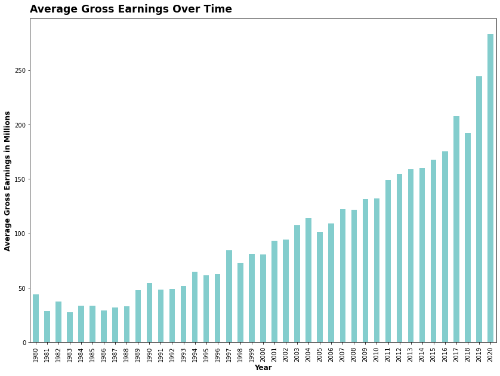
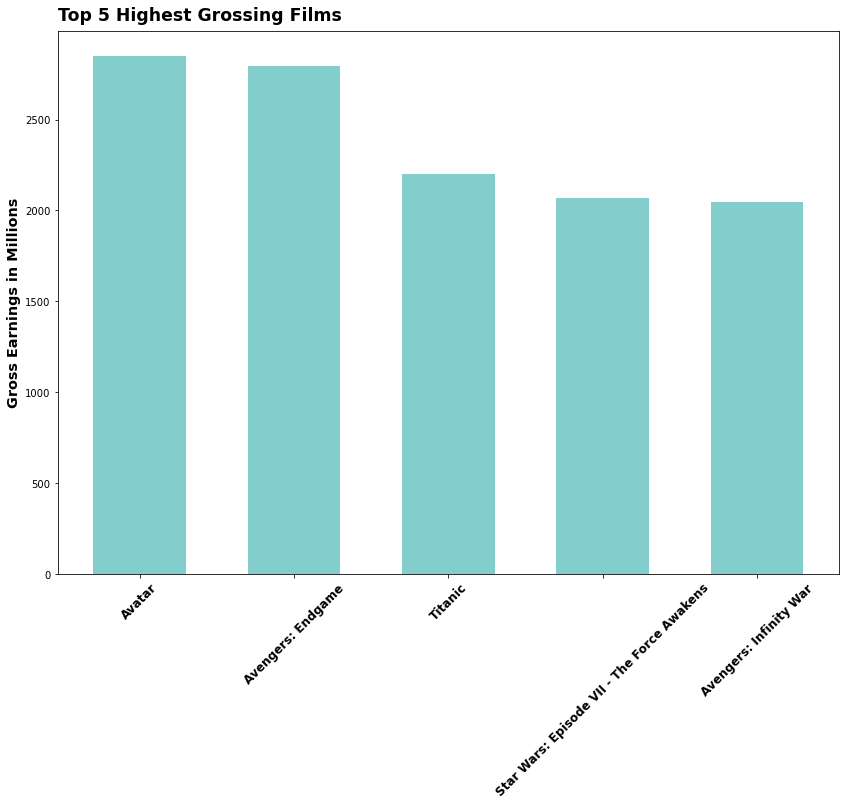
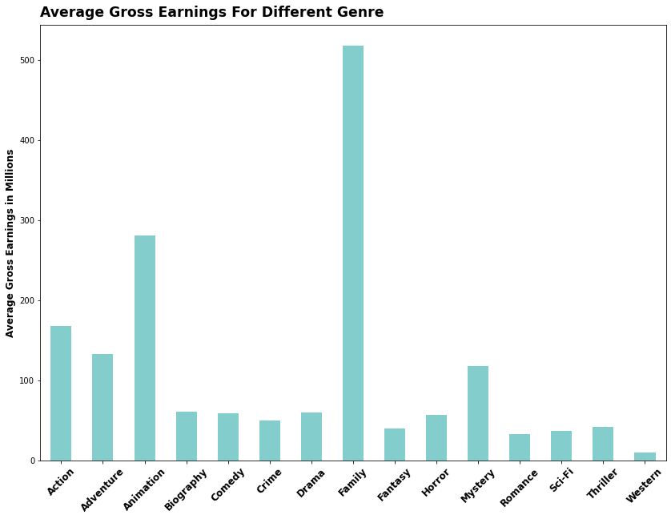
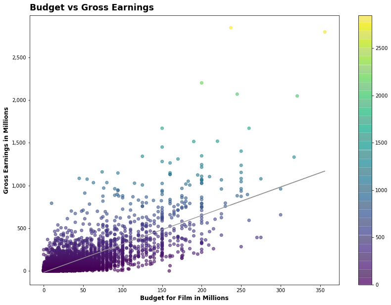
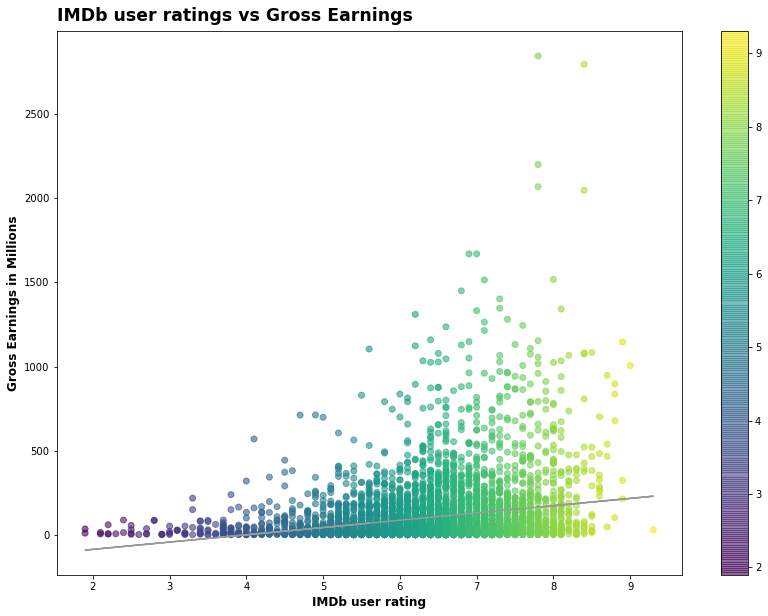
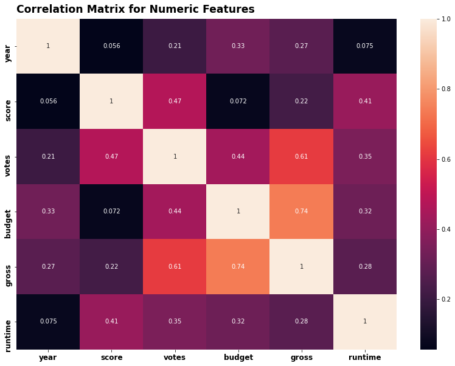
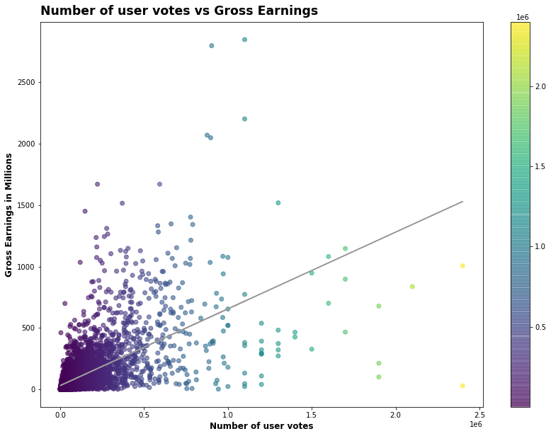
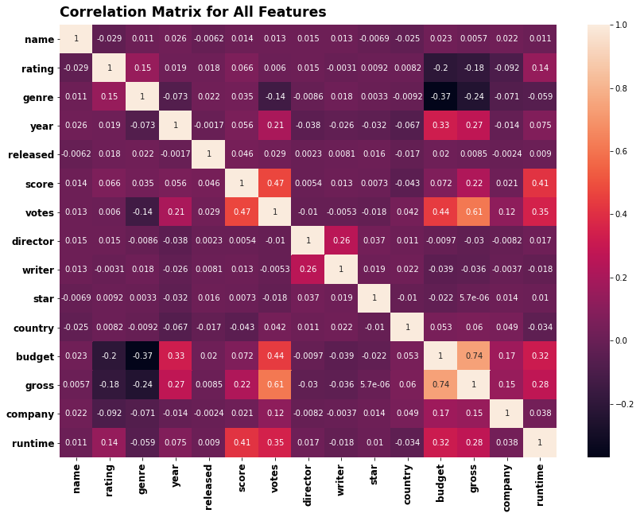

# Is the Movie Industry Dying? 

## Table of Contents
1. [Introduction](#introduction)
2. [Importing Libraries and Data](#import)
3. [Data Cleaning](#clean)
4. [Exploratory Data Analysis](#eda)
    - 4.1 [How has the movie industry been performing in recent years?](#4.1)
    - 4.2 [Top 5 Highest Grossing Films](#4.2)
    - 4.3 [Highest grossing genre](#4.3)
    - 4.4 [Is there a positive correlation between budget and gross earnings?](#4.4)
    - 4.5 [Is there a positive correlation between score and gross earnings?](#4.5)
    - 4.6 [Correlation Matrix for Numeric Variables](#4.6)
    - 4.7 [Correlation between number of user votes and gross earnings](#4.7)
    - 4.8 [Correlation Matrix for All Variables](#4.8)
5. [Conclusion](#conclusion)

## 1. Introduction <a name="introduction"></a>
With the rise of Netflix, Disney +, Apple TV and other streaming services growing rapidly with popularity, one must wonder: Is the movie industry is dying? Are streaming services the new king of entertainment? And if movies are not dead, what is driving the gross earnings in the movie industry?

With this questions in mind, my exploratory data project aims to:

1. Examine how the movie industry been performing in recent years;
2. Visualize the relationship of different variables with movie gross earnings;
3. Explore the variables that have the highest correlation with movie gross earnings

The dataset from this exploratory data analysis was taken from [Kaggle](https://www.kaggle.com/danielgrijalvas/movies). Initial hypothesis for this project are that gross revenue for movies have been declining over the years as adoption of streaming services grows; money spent on making movies `budget`, and IMDb user ratings `score` will have the highest correlation with movie `gross` earnings.

## 2. Importing Libraries and Data <a name="import"></a>


```python
# Importing libraries
import pandas as pd
import numpy as np
import seaborn as sns

import matplotlib.pyplot as plt
import matplotlib.mlab as mlab
import matplotlib
import matplotlib.ticker as mticker
plt.style.use('default')
from matplotlib.pyplot import figure

%matplotlib inline
matplotlib.rcParams['figure.figsize'] = (14,10)

pd.options.mode.chained_assignment = None

# Read in data
df = pd.read_csv('movies.csv')
```


```python
# Glimpse at data
df.head()
```


<div>


|   | name                                           | rating | genre     | year | released                      | score | votes   | director        | writer                  | star           | country        | budget   | gross     | company            | runtime |
|---|------------------------------------------------|--------|-----------|------|-------------------------------|-------|---------|-----------------|-------------------------|----------------|----------------|----------|-----------|--------------------|---------|
| 0 | The Shining                                    | R      | Drama     | 1980 | June 13, 1980 (United States) | 8.4   | 927000  | Stanley Kubrick | Stephen King            | Jack Nicholson | United Kingdom | 19000000 | 46998772  | Warner Bros.       | 146     |
| 1 | The Blue Lagoon                                | R      | Adventure | 1980 | July 2, 1980 (United States)  | 5.8   | 65000   | Randal Kleiser  | Henry De Vere Stacpoole | Brooke Shields | United States  | 4500000  | 58853106  | Columbia Pictures  | 104     |
| 2 | Star Wars: Episode V - The Empire Strikes Back | PG     | Action    | 1980 | June 20, 1980 (United States) | 8.7   | 1200000 | Irvin Kershner  | Leigh Brackett          | Mark Hamill    | United States  | 18000000 | 538375067 | Lucasfilm          | 124     |
| 3 | Airplane!                                      | PG     | Comedy    | 1980 | July 2, 1980 (United States)  | 7.7   | 221000  | Jim Abrahams    | Jim Abrahams            | Robert Hays    | United States  | 3500000  | 83453539  | Paramount Pictures | 88      |
| 4 | Caddyshack                                     | R      | Comedy    | 1980 | July 25, 1980 (United States) | 7.3   | 108000  | Harold Ramis    | Brian Doyle-Murray      | Chevy Chase    | United States  | 6000000  | 39846344  | Orion Pictures     | 98      |

</div>

```python
df.shape()
```
(7668, 15) \
There are 7668 rows and 15 variables in our data frame.

### Content
`budget`: the budget of a movie. Some movies don't have this, so it appears as 0

`company`: the production company

`country`: country of origin

`director`: the director

`genre`: main genre of the movie.

`gross`: revenue of the movie

`name`: name of the movie

`rating`: rating of the movie (R, PG, etc.)

`released`: release date (YYYY-MM-DD)

`runtime`: duration of the movie

`score`: IMDb user rating

`votes`: number of user votes

`star`: main actor/actress

`writer`: writer of the movie

`year`: year of release

## 3. Data Cleaning <a name="clean"></a>


```python
# Checking for missing data
for col in df.columns:
    pct_missing = np.mean(df[col].isnull())
    print('{} - {}%'.format(col, pct_missing))
```

    name - 0.0%
    rating - 0.010041731872717789%
    genre - 0.0%
    year - 0.0%
    released - 0.0002608242044861763%
    score - 0.0003912363067292645%
    votes - 0.0003912363067292645%
    director - 0.0%
    writer - 0.0003912363067292645%
    star - 0.00013041210224308815%
    country - 0.0003912363067292645%
    budget - 0.2831246739697444%
    gross - 0.02464788732394366%
    company - 0.002217005738132499%
    runtime - 0.0005216484089723526%

Since there are few missing data per column, we will be handling missing data by deleting the rows having null values.

```python
# Taking care of missing data
df.dropna(inplace = True)
```


```python
# Data types for our columns
df.dtypes
```


    name         object
    rating       object
    genre        object
    year          int64
    released     object
    score       float64
    votes       float64
    director     object
    writer       object
    star         object
    country      object
    budget      float64
    gross       float64
    company      object
    runtime     float64
    dtype: object


```python
# Changing data types
df['budget'] = df['budget'].div(1000000)
df['gross'] = df['gross'].div(1000000)
df['budget'] = df['budget'].astype('int64')
df['gross'] = df['gross'].astype('int64')
df.head()
```


```python
# Sorting df by gross revenue
pd.set_option('display.max_rows', None)
df = df.sort_values(by = ['gross'], inplace = False, ascending = False)
```


```python
# Drop any duplicates
df.drop_duplicates().head(5)
```


<div>

|      | name                                       | rating | genre  | year | released                          | score | votes   | director      | writer             | star              | country       | budget | gross | company               | runtime |
|------|--------------------------------------------|--------|--------|------|-----------------------------------|-------|---------|---------------|--------------------|-------------------|---------------|--------|-------|-----------------------|---------|
| 5445 | Avatar                                     | PG-13  | Action | 2009 | December 18, 2009 (United States) | 7.8   | 1100000 | James Cameron | James Cameron      | Sam Worthington   | United States | 237    | 2847  | Twentieth Century Fox | 162     |
| 7445 | Avengers: Endgame                          | PG-13  | Action | 2019 | April 26, 2019 (United States)    | 8.4   | 903000  | Anthony Russo | Christopher Markus | Robert Downey Jr. | United States | 356    | 2797  | Marvel Studios        | 181     |
| 3045 | Titanic                                    | PG-13  | Drama  | 1997 | December 19, 1997 (United States) | 7.8   | 1100000 | James Cameron | James Cameron      | Leonardo DiCaprio | United States | 200    | 2201  | Twentieth Century Fox | 194     |
| 6663 | Star Wars: Episode VII - The Force Awakens | PG-13  | Action | 2015 | December 18, 2015 (United States) | 7.8   | 876000  | J.J. Abrams   | Lawrence Kasdan    | Daisy Ridley      | United States | 245    | 2069  | Lucasfilm             | 138     |
| 7244 | Avengers: Infinity War                     | PG-13  | Action | 2018 | April 27, 2018 (United States)    | 8.4   | 897000  | Anthony Russo | Christopher Markus | Robert Downey Jr. | United States | 321    | 2048  | Marvel Studios        | 149     |

</div>


## 4. Exploratory Data Analysis <a name="eda"></a>
### 4.1 How has the movie industry been performing in recent years? <a name="4.1"></a>


    

The data shows that average gross earnings per movie has been on a healthy upward trend despite the diruption from popular streaming services. It is also interesting to note that COVID-19 did not seem to affect gross earnings much from 2019 to 2020.

### 4.2 Top 5 Highest Grossing Films <a name="4.2"></a>

    

    
<div>

|      | name                                       | rating | genre  | year | released                          | score | votes   | director      | writer             | star              | country       | budget | gross | company               | runtime |
|------|--------------------------------------------|--------|--------|------|-----------------------------------|-------|---------|---------------|--------------------|-------------------|---------------|--------|-------|-----------------------|---------|
| 5445 | Avatar                                     | PG-13  | Action | 2009 | December 18, 2009 (United States) | 7.8   | 1100000 | James Cameron | James Cameron      | Sam Worthington   | United States | 237    | 2847  | Twentieth Century Fox | 162     |
| 7445 | Avengers: Endgame                          | PG-13  | Action | 2019 | April 26, 2019 (United States)    | 8.4   | 903000  | Anthony Russo | Christopher Markus | Robert Downey Jr. | United States | 356    | 2797  | Marvel Studios        | 181     |
| 3045 | Titanic                                    | PG-13  | Drama  | 1997 | December 19, 1997 (United States) | 7.8   | 1100000 | James Cameron | James Cameron      | Leonardo DiCaprio | United States | 200    | 2201  | Twentieth Century Fox | 194     |
| 6663 | Star Wars: Episode VII - The Force Awakens | PG-13  | Action | 2015 | December 18, 2015 (United States) | 7.8   | 876000  | J.J. Abrams   | Lawrence Kasdan    | Daisy Ridley      | United States | 245    | 2069  | Lucasfilm             | 138     |
| 7244 | Avengers: Infinity War                     | PG-13  | Action | 2018 | April 27, 2018 (United States)    | 8.4   | 897000  | Anthony Russo | Christopher Markus | Robert Downey Jr. | United States | 321    | 2048  | Marvel Studios        | 149     |

</div>  
<br>
The barplot above shows the top 5 highest grossing films. While average gross earnings for films have been increasing over the years, it is interesting to see that Avatar from 2009 still ranks as the highest grossing film ever.

Also, note that 4 of the top 5 grossing films ever are Action films. That makes us wonder what `genre` produces the highest grossing films on average?

### 4.3 Highest grossing genre <a name="4.3"></a>
    


Surprisingly, while 4 of the top 5 grossing films ever are Action films, the highest grossing `genre` is Family type movies not Action. However, Action films still come in at a close third right behind Animation films.

Now to answer one of our key hypothesis, we'll look at the variables that we think have the highest correlation with gross earnings.

### 4.4 Is there a positive correlation between budget and gross earnings? <a name="4.4"></a>


    


From the scatter plot above, as we expected, it looks like there is a strong positive correlation between `budget` and `gross` earnings. Movies that have higher budgets have produced higher gross earnings. 

What about user ratings/`score` and `gross` earnings?

### 4.5 Is there a positive correlation between score and gross earnings? <a name="4.5"></a>


    

    


While we thought that IMDb user ratings, `score`, would have a strong positive correlation with `gross` earnings, it does not look like the case from the data.

We could visualise every variable with gross earnings with a scatter plot, but a correlation matrix will give us a quicker overview at a glance.

###  4.6 Correlation Matrix for Numeric Variables <a name="4.6"></a>

    

    


In this correlation matrix, we utilise the Pearson method to return correlation coefficients that range from +1 to -1 with +1 representing positive correlation, -1 representing a negative correlation, and 0 representing no relationship. The darkest color have the lowest correlation coefficient, and the lightest color has the highest correlation coefficient. 

Unsurprisingly, `budget` does have the highest correlation with gross earnings. But we did not expect that number of user `votes` would have such a strong correlation with `gross` earnings.

Lets take a look at the scatter plot of `votes` with `gross`.

### 4.7 Correlation between number of user votes and gross earnings <a name="4.7"></a>
    

    


Indeed there's clear positive correlation between number of user `votes` and `gross` earnings.

While the correlation matrix above showed us the correlation between gross earnings and numeric variables, what about the correlation betweem gross earnings and non-numeric variables? 

To explore the aforementioned, we have to convert non-numeric variables to numeric ones.

<br>

#### Original Dataframe
<div>

|      | name                                       | rating | genre  | year | released                          | score | votes   | director      | writer             | star              | country       | budget | gross | company               | runtime |
|------|--------------------------------------------|--------|--------|------|-----------------------------------|-------|---------|---------------|--------------------|-------------------|---------------|--------|-------|-----------------------|---------|
| 5445 | Avatar                                     | PG-13  | Action | 2009 | December 18, 2009 (United States) | 7.8   | 1100000 | James Cameron | James Cameron      | Sam Worthington   | United States | 237    | 2847  | Twentieth Century Fox | 162     |
| 7445 | Avengers: Endgame                          | PG-13  | Action | 2019 | April 26, 2019 (United States)    | 8.4   | 903000  | Anthony Russo | Christopher Markus | Robert Downey Jr. | United States | 356    | 2797  | Marvel Studios        | 181     |
| 3045 | Titanic                                    | PG-13  | Drama  | 1997 | December 19, 1997 (United States) | 7.8   | 1100000 | James Cameron | James Cameron      | Leonardo DiCaprio | United States | 200    | 2201  | Twentieth Century Fox | 194     |
| 6663 | Star Wars: Episode VII - The Force Awakens | PG-13  | Action | 2015 | December 18, 2015 (United States) | 7.8   | 876000  | J.J. Abrams   | Lawrence Kasdan    | Daisy Ridley      | United States | 245    | 2069  | Lucasfilm             | 138     |
| 7244 | Avengers: Infinity War                     | PG-13  | Action | 2018 | April 27, 2018 (United States)    | 8.4   | 897000  | Anthony Russo | Christopher Markus | Robert Downey Jr. | United States | 321    | 2048  | Marvel Studios        | 149     |

</div>  
<br>

#### Numerized Dataframe

<div>

|      | name | rating | genre | year | released | score | votes   | director | writer | star | country | budget | gross | company | runtime |
|------|------|--------|-------|------|----------|-------|---------|----------|--------|------|---------|--------|-------|---------|---------|
| 5445 | 386  | 5      | 0     | 2009 | 527      | 7.8   | 1100000 | 785      | 1263   | 1534 | 47      | 237    | 2847  | 1382    | 162     |
| 7445 | 388  | 5      | 0     | 2019 | 137      | 8.4   | 903000  | 105      | 513    | 1470 | 47      | 356    | 2797  | 983     | 181     |
| 3045 | 4909 | 5      | 6     | 1997 | 534      | 7.8   | 1100000 | 785      | 1263   | 1073 | 47      | 200    | 2201  | 1382    | 194     |
| 6663 | 3643 | 5      | 0     | 2015 | 529      | 7.8   | 876000  | 768      | 1806   | 356  | 47      | 245    | 2069  | 945     | 138     |
| 7244 | 389  | 5      | 0     | 2018 | 145      | 8.4   | 897000  | 105      | 513    | 1470 | 47      | 321    | 2048  | 983     | 149     |
</div>
<br>

The original dataframe displayed above can be used to compare with the 'numerized' dataframe to see the corresponding variable.

With a 'numerized' dataframe, we can now explore the correlation betweem gross earnings and non-numeric variables.

### 4.8 Correlation Matrix for All Variables <a name="4.8"></a>


    

    


## 5 Conclusion <a name="conclusion"></a>
Lets sort the correlation to find the highest correlation – displaying variables with correlation > 0.5 with `gross`


    votes   gross     0.614722
    gross   votes     0.614722
    gross   budget    0.740077
    budget  gross     0.740077
    dtype: float64


Through this exploratory data analysis, we can confirm the following findings:

1. Despite the growing adoption of streaming services, movie's gross earnings have still been increasing over the years.
2. Although 4 of the top 5 grossing films ever were Action films, Family films have the highest gross earnings on average.
3. Gross earnings have the strongest positive correlation with `votes` and `budget` - that is the films with the highest number of user votes and highest budget return the highest gross earnings.
